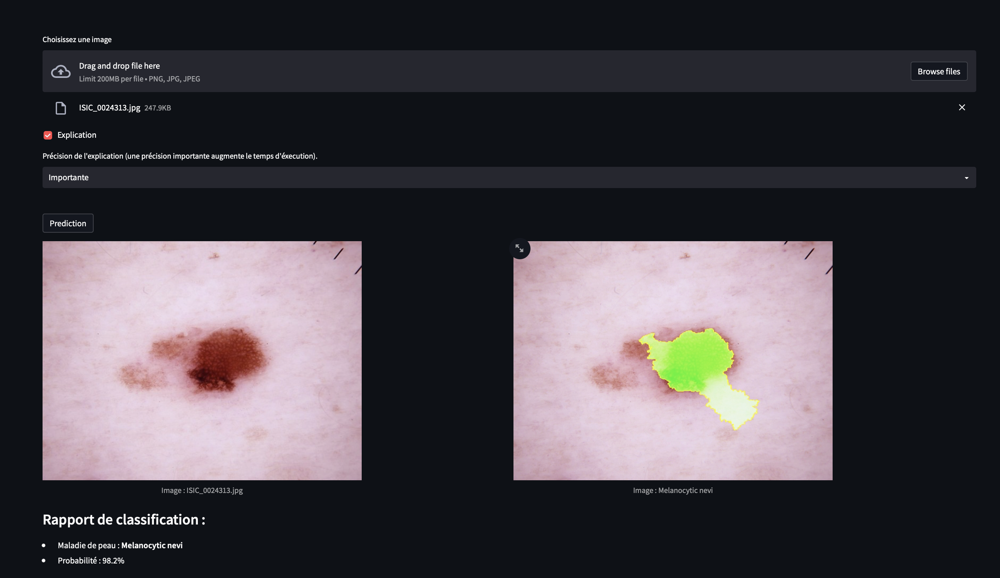

# MLBIO Project: Skin Disease Classification

Welcome to the Skin Disease Classification project! The goal of this project is to classify different skin diseases using the HAM10000 dataset and provide an explanation for the model's decision using the LIME library.

### Classification Examples

The green shapes indicate the areas used to explain the model's decision.




### Training Data and Model Performance

To achieve this goal, we trained our model using the HAM10000 dataset with 2140 training examples and 795 validation examples. We retrained the ResNet34 model for 15 epochs (training duration ~1h15) and retained the best-performing model. We achieved an accuracy of 81% on the training data and 73% on the test data.

A pre-trained model is already available (and used for classification), but you can retrain it using the following command:

```bash
python main_train.py [-h] [--epochs EPOCHS] [--modelname MODELNAME] [--fine_tune] [--type TYPE] root
```

- --epochs EPOCHS: Number of training epochs (default: 15).
- --modelname MODELNAME: Name of the model to be saved (default: 'model/model_resnet34.pth').
- --fine_tune: Retrain only the last layer of the model (default: False).
- --type: Type of model to train ('resnet18' or 'resnet34') (default: 'resnet34').
- root: Path to the directory containing the training images. This directory must contain a file named *HAM10000_metadata.csv* with metadata and two subdirectories, *HAM10000_images_train* and *HAM10000_images_test*, containing training and test images, respectively.

Example directory structure:

```bash
root/
|--- HAM10000_metadata.csv
|--- HAM10000_images_train/
|    |--- ISIC_0024306.jpg
|    |--- ISIC_0024307.jpg
|    |--- ...
|--- HAM10000_images_test/
|    |--- ISIC_0024308.jpg
|    |--- ISIC_0024309.jpg
|    |--- ...
```

### Server

This project includes a server that allows users to classify skin diseases by sending their images. The server uses the trained model to classify the images and returns the predicted class, probability, and an explanation of the model's decision to the user. The server can be launched using the following command:

```bash
docker-compose up -d.
```

The server can use two types of models: *resnet18* or *resnet34*. The default model is *resnet34*, but you can change it by modifying the *MODEL* environment variable in the *docker-compose.yml* file.

### Graphical User Interface

In addition to the server, this project also includes a graphical interface built with Streamlit, which can be launched using the following command:

```bash
streamlit run src/frontend.py
```

The graphical interface (http://localhost:8501/) allows users to classify images by uploading them through a web browser and view the explanation of the model's decision.


### Command-line Interface

Users can classify images using the command-line interface (CLI) by running *client.py*. The CLI is used as follows:

```bash
python client.py [-h] [--explain] [--precision PRECISION] image
```

- --explain: Provides a detailed explanation of the model's prediction.
- --precision PRECISION: Sets the explanation precision. Valid values are *Low*, *Medium*, and *High*. Higher precision will provide more accurate results but increase execution time.
- image: The path to the image or images to classify.

For example, to classify an image *test.jpg* with an explanation and high precision, you can use the following command:

```bash
python client.py --explain --precision High test.jpg
```

### API

Users can also classify images using the API by making a POST request to the endpoint http://127.0.0.1:8089/predict with the attached image. To make a request to the API, you must send a JSON object with the following fields:

| Field | Description | Mandatory |
| ----- | ----------- | ----------- |
| image | The image to classify, encoded in base64. | Yes |
| explain | If you want to include an explanation in the response. (bool) | No |
| precision | The desired precision. Valid values are *Low*, *Medium*, and *High*. | No |

Here is an example of an API request using the curl command:

```bash
curl -X POST -H "Content-Type: application/json" -d '{
  "image": "base64_encoded_image_data",
  "explain": true,
  "precision": "High"
}' http://127.0.0.1:8089/predict
```

In case of success, the server returns a JSON object in the following format:

```json
{
  "success": true,
  "prediction": "Melanocytic nevi",
  "probability": 0.95,
  "explain": "explanation_image" // Array
}
```

In case of failure, the server returns a JSON object in the following format:

```json
{
  "success": false,
  "error": "error_message"
}
```

### Information
- Execution time for an image with precision:
  - Low: ~10 seconds
  - Medium: ~1.15 minutes
  - High: ~4.30 minutes

## Credits

- [torchvision](https://pytorch.org/vision/stable/index.html): For using the pre-trained ResNet34 model.
- [Kaggle](https://www.kaggle.com/kmader/skin-cancer-mnist-ham10000): For the HAM10000 dataset.
- [LIME](https://github.com/marcotcr/lime): For prediction explanations.
- [Streamlit](https://www.streamlit.io/): For the graphical interface.
- [Flask](https://flask.palletsprojects.com/en/2.2.x/): For the server.