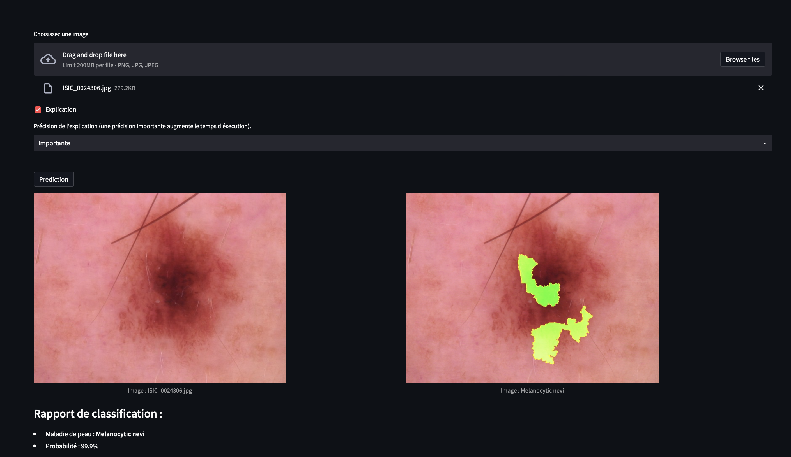

# Projet MLBIO : Classification des maladies de la peau

Bienvenue dans le projet de classification des maladies de la peau ! Le but de ce projet est de classifier différentes maladies de la peau en utilisant le jeu de données HAM10000 et de fournir une explication sur la décision prise par le modèle en utilisant la bibliothèque LIME.

### Training data et performance du modèle

Pour atteindre cet objectif, nous avons entraîné notre modèle en utilisant le jeu de données HAM10000 avec 2122 exemples d'entraînement et 519 exemples de validation. Nous avons réentraîné le modèle ResNet34 sur 15 époques et conservé le modèle le plus performant. Nous avons obtenu une précision de 80% sur les donées d'entraînement et de 70% sur les donées de test.

Un modèle pré-entraîné est déjà disponible (et utilisé pour la classification), mais vous pouvez réentraîner le modèle en utilisant la commande suivante :

```bash
python main_train.py [-h] [--epochs EPOCHS] [--modelname MODELNAME] root
```

Les arguments sont les suivants :
- --epochs EPOCHS : Nombre d'époques d'apprentissage (par défaut : 15)
- modelname MODELNAME : Nom du modèle à sauvegarder (par défaut : 'model/model_mlbio.pth')
- root : chemin d'accès au répertoire contenant les images d'entraînement. Ce répertoire doit contenir un fichier nommé *HAM10000_metadata.csv* avec les métadonnées et deux sous-répertoires, *HAM10000_images_train* et *HAM10000_images_test*, contenant respectivement les images d'entraînement et de test.", example si-dessous :

```bash
root/
|--- HAM10000_metadata.csv
|--- HAM10000_images_train/
|    |--- ISIC_0024306.jpg
|    |--- ISIC_0024307.jpg
|    |--- ...
|--- HAM10000_images_test/
|    |--- ISIC_0024308.jpg
|    |--- ISIC_0024309.jpg
|    |--- ...
```

### Serveur

Ce projet comprend un serveur qui permet aux utilisateurs, en envoyant leurs images, de classifier les maladies de peau en envoyant. Le serveur utilise le modèle entraîné pour classer les images et renvoie à l'utilisateur la classe prédite, sa probabilité et une explication de la décision du modèle. Le serveur peut être lancé à l'aide de la commande : 

```bash
docker-compose up -d.
```

### Interface graphique

En plus du serveur, ce projet comprend également une interface graphique construite avec Streamlit, qui peut être lancée avec la commande : 

```bash
streamlit run src/frontend.py
```

L'interface graphique (http://localhost:8501/) permet aux utilisateurs de classifier des images en les téléchargeant via un navigateur web et de visualiser l'explication de la décision du modèle.



### Command-line interface

Les utilisateurs peuvent également classifier les images en utilisant la command-line interface (CLI) en exécutant *client.py*. La CLI s'utilise de la façon suivante : 

```bash
python client.py [-h] [--explain] [--precision PRECISION] image
```

Les arguments sont les suivants :
- --explain : Fournit une explication détaillée de la prédiction du modèle.
- --precision PRECISION : Définit la précision de la probabilité dans la sortie. Les valeurs valides sont *Faible*, *Moyenne* et *Importante*. Une précision plus élevée donnera des résultats plus précis, mais augmentera également le temps d'exécution.
- image : Le chemin vers l'image ou les images à classifier.

Par exemple, pour classer une image *test.jpg* avec une explication et une précision *Importante*, vous pouvez utiliser la commande suivante :

```bash
python client.py --explain --precision Importante test.jpg
```

### API

Les utilisateurs peuvent également classifier des images à l'aide de l'API en effectuant une requête POST vers l'endpoint ""http://127.0.0.1:8089/predict" avec l'image jointe. Pour faire une demande à l'API, vous devez envoyer un objet JSON avec les champs suivants :

| Champ | Description | Obligatoire |
| ----- | ----------- | ----------- |
| image | L'image à classifier, encodée en base64. | Oui |
| explain | Si vous souhaitez inclure une explication dans la réponse. (bool) | Non |
| precision | La précision souhaitée. Les valeurs valides sont *Faible*, *Moyenne* et *Importante*. | Non |

Voici un exemple de demande à l'API à l'aide de la commande curl :

```bash
curl -X POST -H "Content-Type: application/json" -d '{
  "image": "base64_encoded_image_data",
  "explain": true,
  "precision": "high"
}' http://127.0.0.1:8089/predict
```


En cas de réussite, le serveur renvoie un objet JSON au format suivant :

```json
{
  "success": true,
  "prediction": "Melanocytic nevi",
  "probability": 0.95,
  "explain": "explanation_image" // Array
}
```

En cas d'échec, le serveur renvoie un objet JSON au format suivant :

```json
{
  "success": false,
  "error": "error_message"
}
```

## Crédits

- [torchvision](https://pytorch.org/vision/stable/index.html) : Pour utiliser le modèle ResNet34 pré-entraîné.
- [Kaggle](https://www.kaggle.com/kmader/skin-cancer-mnist-ham10000) : Pour le jeu de données HAM10000.
- [LIME](https://github.com/marcotcr/lime) : Pour l'explication des prédictions.
- [Streamlit](https://www.streamlit.io/) : Pour l'interface graphique.
- [Flask](https://flask.palletsprojects.com/en/2.2.x/) : Pour le serveur.